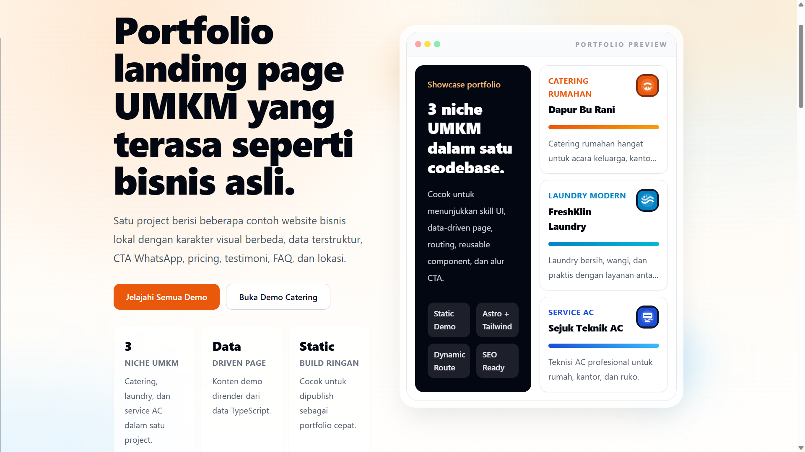
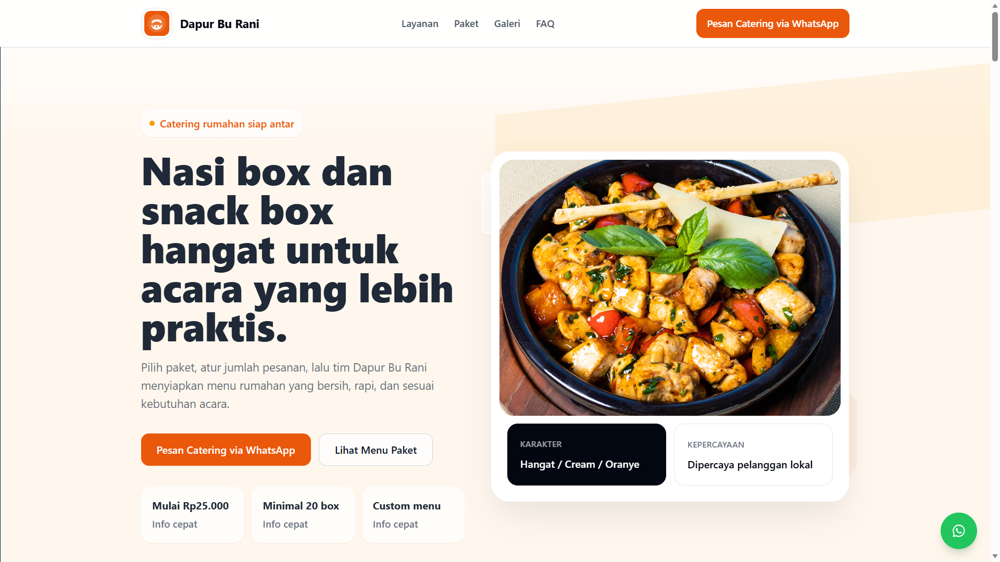
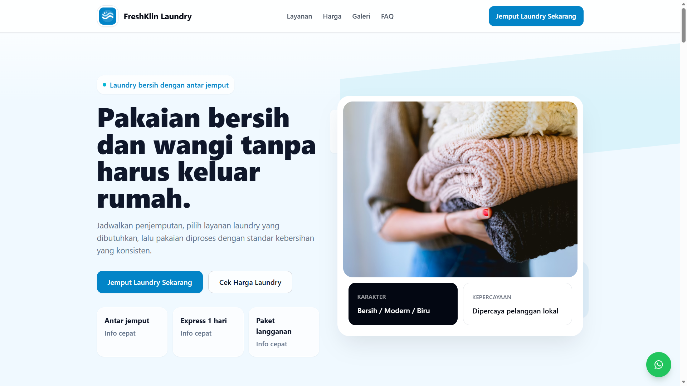
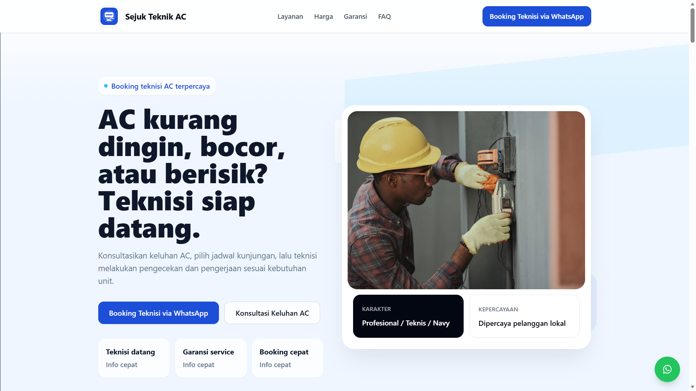

# Local Business Landing Pages

Astro + Tailwind CSS landing page portfolio for local business and UMKM website demos.



## Overview

**Local Business Landing Pages** adalah project portfolio berbasis Astro yang berisi beberapa contoh landing page untuk bisnis lokal atau UMKM.

Project ini dibuat untuk menunjukkan bagaimana satu codebase dapat digunakan untuk membuat beberapa landing page bisnis dengan tampilan, warna, konten, CTA, dan karakter visual yang berbeda.

Demo yang tersedia saat ini:

* Dapur Bu Rani — Catering Landing Page
* FreshKlin Laundry — Laundry Service Landing Page
* Sejuk Teknik AC — AC Service Landing Page

> Demo concept — bukan bisnis asli. Semua nama bisnis, alamat, harga, nomor WhatsApp, testimoni, dan data layanan adalah data dummy untuk kebutuhan portfolio.

---

## Live Demo

Main showcase:

```txt
https://umkm.notech.my.id
```

Demo pages:

```txt
https://umkm.notech.my.id/demo/dapur-bu-rani
https://umkm.notech.my.id/demo/freshklin-laundry
https://umkm.notech.my.id/demo/sejuk-teknik-ac
```

---

## Screenshots

| Homepage Showcase                                              | Catering Landing Page                                  |
| -------------------------------------------------------------- | ------------------------------------------------------ |
|  |  |

| Laundry Landing Page                                                 | AC Service Landing Page                                          |
| -------------------------------------------------------------------- | ---------------------------------------------------------------- |
|  |  |

---

## Project Goals

Tujuan utama project ini adalah membuat **landing page portfolio UMKM yang terlihat seperti bisnis asli**, bukan sekadar template kosong.

Project ini menunjukkan beberapa kemampuan frontend seperti:

* Membuat landing page bisnis lokal yang modern dan responsive.
* Menggunakan Astro dynamic route untuk membuat banyak halaman dari data.
* Memisahkan konten bisnis ke file TypeScript agar mudah dikelola.
* Membuat komponen reusable untuk section landing page.
* Menambahkan CTA WhatsApp yang relevan untuk bisnis lokal.
* Menyiapkan SEO dasar, Open Graph meta tag, dan struktur halaman yang rapi.
* Membangun static website yang ringan dan mudah dideploy.

---

## Demo Pages

| Demo              | Business Type                                            | Live URL                  |
| ----------------- | -------------------------------------------------------- | ------------------------- |
| Dapur Bu Rani     | Catering, nasi box, snack box, tumpeng mini              | `/demo/dapur-bu-rani`     |
| FreshKlin Laundry | Laundry kiloan, express, setrika, bed cover, cuci sepatu | `/demo/freshklin-laundry` |
| Sejuk Teknik AC   | Service AC, cuci AC, isi freon, bongkar pasang AC        | `/demo/sejuk-teknik-ac`   |

---

## Key Features

* Homepage showcase untuk daftar demo UMKM.
* Dynamic route Astro dengan `/demo/[slug]`.
* Data-driven rendering dari file TypeScript.
* Reusable components untuk layout, navbar, footer, button, dan section.
* Responsive design untuk mobile, tablet, dan desktop.
* Hero section dengan CTA utama.
* Layanan dan paket harga.
* Gallery section.
* Testimonial section.
* FAQ accordion dengan vanilla JavaScript.
* Location section dengan Google Maps embed.
* Floating WhatsApp button.
* SEO dasar dengan title dan meta description.
* Open Graph meta tag dan Twitter Card.
* Static Site Generation sehingga ringan untuk production.

---

## Tech Stack

* Astro
* Tailwind CSS
* TypeScript
* Static Site Generation
* Vercel
* GitHub
* Google Maps Embed

---

## Project Structure

```txt
src/
|-- components/
|   |-- common/
|   |   |-- Button.astro
|   |   |-- Container.astro
|   |   |-- FloatingWhatsApp.astro
|   |   |-- Footer.astro
|   |   |-- Navbar.astro
|   |   `-- SectionHeader.astro
|   |
|   `-- sections/
|       |-- FAQSection.astro
|       |-- FeatureSection.astro
|       |-- FinalCTASection.astro
|       |-- GallerySection.astro
|       |-- HeroSection.astro
|       |-- LocationSection.astro
|       |-- OrderStepsSection.astro
|       |-- PricingSection.astro
|       |-- ProblemSection.astro
|       |-- ServiceSection.astro
|       `-- TestimonialSection.astro
|
|-- data/
|   |-- businesses/
|   |   |-- dapur-bu-rani.ts
|   |   |-- freshklin-laundry.ts
|   |   |-- sejuk-teknik-ac.ts
|   |   `-- types.ts
|   `-- demo-list.ts
|
|-- layouts/
|   `-- MainLayout.astro
|
|-- pages/
|   |-- index.astro
|   `-- demo/
|       `-- [slug].astro
|
|-- styles/
|   `-- global.css
|
`-- utils/
    |-- formatWhatsApp.ts
    `-- getBusinessBySlug.ts
```

---

## How It Works

Alur render halaman demo:

```txt
User membuka /demo/dapur-bu-rani
        ↓
Astro membaca slug dari dynamic route
        ↓
Data bisnis diambil dari src/data/businesses
        ↓
Halaman dirender menggunakan reusable sections
        ↓
User melihat layanan, harga, testimoni, lokasi, dan CTA WhatsApp
```

Dengan pendekatan ini, demo bisnis baru bisa ditambahkan tanpa membuat ulang semua komponen dari awal. Cukup membuat file data bisnis baru, lalu mendaftarkannya ke daftar demo.

---

## Getting Started

Install dependencies:

```bash
npm install
```

Run development server:

```bash
npm run dev
```

Open in browser:

```txt
http://localhost:4321
```

For Windows PowerShell, you can also use:

```bash
npm.cmd install
npm.cmd run dev
```

---

## Build

Build for production:

```bash
npm run build
```

Preview production build:

```bash
npm run preview
```

For Windows PowerShell:

```bash
npm.cmd run build
npm.cmd run preview
```

---

## Deployment

This project is deployed on Vercel.

Recommended Vercel settings:

```txt
Framework Preset : Astro
Build Command    : npm run build
Output Directory : dist
Install Command  : npm ci --no-audit --no-fund
```

The project can also be deployed to Netlify or any static hosting provider.

Netlify settings:

```txt
Build Command     : npm run build
Publish Directory : dist
```

---

## Data Management

All business content is stored inside:

```txt
src/data/businesses/
```

Each business data file contains content such as:

* Business profile
* Hero content
* Customer problems
* Services
* Pricing packages
* Features
* Gallery
* Testimonials
* Order steps
* FAQ
* Location and service area
* Final CTA
* SEO metadata

This makes the project easier to scale when adding more demo niches.

---

## Current Demo Niches

* Catering landing page
* Laundry service landing page
* AC service landing page

---

## Future Improvements

* Add more demo niches such as barbershop, bakery, florist, beauty clinic, motorcycle repair shop, and coffee shop.
* Add homepage category filter.
* Add small animation or transition effects.
* Add a short case study section for each demo.
* Improve image assets using local optimized images.
* Add Lighthouse performance screenshot to the README.
* Add more realistic business copywriting for each niche.

---

## Disclaimer

This is a sample portfolio project.

All business names, prices, addresses, testimonials, phone numbers, and service details are fictional and used only for demo purposes.

---

## License

This project is licensed under the MIT License.
