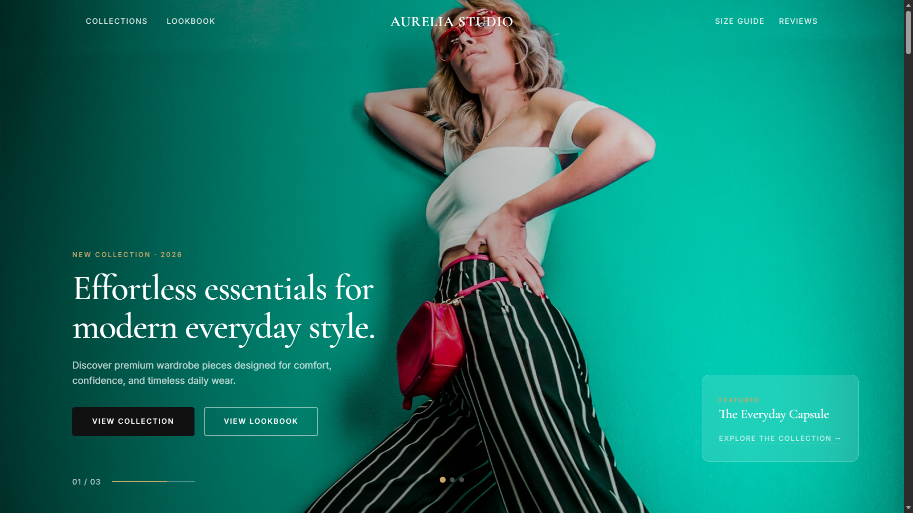

# Local Business Landing Pages

Portfolio project berisi kumpulan landing page demo untuk bisnis lokal, UMKM, dan brand kecil. Project ini dibuat menggunakan **Astro**, **Tailwind CSS**, dan pendekatan data-driven agar satu codebase bisa digunakan untuk banyak niche bisnis.


## Overview

**Local Business Landing Pages** adalah project portfolio frontend yang menampilkan beberapa contoh landing page bisnis dengan karakter visual, warna, CTA, konten, dan alur konversi yang berbeda.

Project ini tidak dibuat sebagai website jasa pribadi, marketplace, atau aplikasi transaksi. Fokus utamanya adalah menunjukkan kemampuan membangun landing page bisnis yang ringan, responsive, reusable, dan terasa seperti project nyata.

Demo yang tersedia saat ini:

* **Dapur Bu Rani** — Catering Landing Page
* **FreshKlin Laundry** — Laundry Service Landing Page
* **Sejuk Teknik AC** — AC Service Landing Page
* **Aurelia Studio** — Premium English Fashion Landing Page

> Demo concept — bukan bisnis asli. Semua nama bisnis, alamat, harga, nomor WhatsApp, testimoni, dan data layanan adalah data dummy untuk kebutuhan portfolio.

---

## Live Demo

Main showcase:

```txt
https://umkm.notech.my.id
```

Demo pages:

```txt
https://umkm.notech.my.id/demo/dapur-bu-rani
https://umkm.notech.my.id/demo/freshklin-laundry
https://umkm.notech.my.id/demo/sejuk-teknik-ac
https://umkm.notech.my.id/demo/aurelia-studio
https://umkm.notech.my.id/demo/aurelia-studio/collection
```

Portfolio:

```txt
https://notech.my.id
```

---

## Screenshots

| Homepage Showcase                                              | Catering Landing Page                                  |
| -------------------------------------------------------------- | ------------------------------------------------------ |
|  |  |

| Laundry Landing Page                                                 | AC Service Landing Page                                          |
| -------------------------------------------------------------------- | ---------------------------------------------------------------- |
|  |  |

| Fashion Landing Page                                     |
| -------------------------------------------------------- |
|  |

---

## Project Goals

Tujuan utama project ini adalah membuat **portfolio landing page bisnis yang mudah ditunjukkan ke calon klien**, bukan hanya berupa screenshot desain.

Project ini menunjukkan beberapa kemampuan frontend seperti:

* Membuat landing page bisnis lokal yang modern dan responsive.
* Membuat homepage showcase untuk menampilkan beberapa demo project.
* Menggunakan Astro dynamic route untuk halaman demo berbasis data.
* Memisahkan konten bisnis ke file TypeScript agar mudah dikelola.
* Membuat komponen reusable untuk section landing page.
* Menambahkan CTA WhatsApp yang relevan untuk bisnis lokal.
* Menyiapkan SEO dasar, Open Graph meta tag, dan struktur heading yang rapi.
* Membuat premium English landing page untuk brand fashion.
* Membuat static website yang ringan dan mudah dideploy.

---

## Demo Pages

| Demo              | Business Type                                            | Language   | URL                       |
| ----------------- | -------------------------------------------------------- | ---------- | ------------------------- |
| Dapur Bu Rani     | Catering, nasi box, snack box, tumpeng mini              | Indonesian | `/demo/dapur-bu-rani`     |
| FreshKlin Laundry | Laundry kiloan, express, setrika, bed cover, cuci sepatu | Indonesian | `/demo/freshklin-laundry` |
| Sejuk Teknik AC   | Service AC, cuci AC, isi freon, bongkar pasang AC        | Indonesian | `/demo/sejuk-teknik-ac`   |
| Aurelia Studio    | Premium fashion boutique landing page                    | English    | `/demo/aurelia-studio`    |

---

## Key Features

* Homepage showcase untuk daftar project landing page.
* Dynamic route Astro dengan `/demo/[slug]`.
* Data-driven rendering dari file TypeScript.
* Reusable components untuk layout, navbar, footer, button, dan section.
* Responsive design untuk mobile, tablet, dan desktop.
* Hero section dengan CTA utama.
* Section layanan dan paket harga.
* Gallery atau lookbook section.
* Testimonial section.
* FAQ accordion dengan vanilla JavaScript.
* Location section dengan Google Maps embed untuk demo lokal.
* Floating WhatsApp button untuk CTA cepat.
* Product quick view dan collection page untuk demo fashion.
* SEO dasar dengan title dan meta description.
* Open Graph meta tag dan Twitter Card.
* Static Site Generation sehingga ringan untuk production.

---

## Tech Stack

* Astro
* Tailwind CSS
* TypeScript
* Vanilla JavaScript
* Static Site Generation
* Vercel
* GitHub
* Google Maps Embed

---

## Project Structure

```txt
src/
|-- components/
|   |-- common/
|   |   |-- Button.astro
|   |   |-- Container.astro
|   |   |-- FloatingWhatsApp.astro
|   |   |-- Footer.astro
|   |   |-- Navbar.astro
|   |   `-- SectionHeader.astro
|   |
|   `-- sections/
|       |-- FAQSection.astro
|       |-- FeatureSection.astro
|       |-- FinalCTASection.astro
|       |-- GallerySection.astro
|       |-- HeroSection.astro
|       |-- LocationSection.astro
|       |-- OrderStepsSection.astro
|       |-- PricingSection.astro
|       |-- ProblemSection.astro
|       |-- ServiceSection.astro
|       `-- TestimonialSection.astro
|
|-- data/
|   |-- businesses/
|   |   |-- dapur-bu-rani.ts
|   |   |-- freshklin-laundry.ts
|   |   |-- sejuk-teknik-ac.ts
|   |   `-- types.ts
|   `-- demo-list.ts
|
|-- layouts/
|   `-- MainLayout.astro
|
|-- pages/
|   |-- index.astro
|   `-- demo/
|       |-- [slug].astro
|       `-- aurelia-studio/
|           |-- index.astro
|           `-- collection.astro
|
|-- styles/
|   `-- global.css
|
`-- utils/
    |-- formatWhatsApp.ts
    `-- getBusinessBySlug.ts
```

---

## How It Works

Alur render halaman demo lokal:

```txt
User membuka /demo/dapur-bu-rani
        ↓
Astro membaca slug dari dynamic route
        ↓
Data bisnis diambil dari src/data/businesses
        ↓
Halaman dirender menggunakan reusable sections
        ↓
User melihat layanan, harga, testimoni, lokasi, FAQ, dan CTA WhatsApp
```

Dengan pendekatan ini, demo bisnis baru bisa ditambahkan tanpa membuat ulang semua komponen dari awal. Cukup membuat file data bisnis baru, lalu mendaftarkannya ke daftar demo.

Untuk demo fashion, halaman dibuat sebagai special page karena layout, visual direction, hero slider, collection page, dan product quick view memiliki kebutuhan UI yang berbeda dari demo UMKM lokal.

---

## Getting Started

Install dependencies:

```bash
npm install
```

Run development server:

```bash
npm run dev
```

Open in browser:

```txt
http://localhost:4321
```

For Windows PowerShell, you can also use:

```bash
npm.cmd install
npm.cmd run dev
```

---

## Build

Build for production:

```bash
npm run build
```

Preview production build:

```bash
npm run preview
```

For Windows PowerShell:

```bash
npm.cmd run build
npm.cmd run preview
```

---

## Disable Astro Dev Toolbar

To disable Astro Dev Toolbar for this project, update `astro.config.mjs`:

```js
import { defineConfig } from "astro/config";

export default defineConfig({
  devToolbar: {
    enabled: false,
  },
});
```

Or run the command through npm:

```bash
npm run astro preferences disable devToolbar
```

---

## Deployment

This project is deployed on Vercel.

Recommended Vercel settings:

```txt
Framework Preset : Astro
Build Command    : npm run build
Output Directory : dist
Install Command  : npm ci --no-audit --no-fund
```

The project can also be deployed to Netlify or any static hosting provider.

Netlify settings:

```txt
Build Command     : npm run build
Publish Directory : dist
```

---

## Data Management

All local business content is stored inside:

```txt
src/data/businesses/
```

Each business data file contains content such as:

* Business profile
* Hero content
* Customer problems
* Services
* Pricing packages
* Features
* Gallery
* Testimonials
* Order steps
* FAQ
* Location and service area
* Final CTA
* SEO metadata

This makes the project easier to scale when adding more demo niches.

---

## Current Demo Niches

* Catering landing page
* Laundry service landing page
* AC service landing page
* Premium fashion landing page

---

## Future Improvements

* Add more demo niches such as barbershop, bakery, florist, beauty clinic, motorcycle repair shop, coffee shop, and real estate.
* Add a case study page for each demo project.
* Improve local image optimization.
* Add Lighthouse performance screenshots to the README.
* Add more realistic business copywriting for each niche.
* Convert the fashion page into smaller Astro components.
* Add reusable layout variants for product-based businesses.

---

## Author

Built by **NoTechID**

Portfolio:

```txt
https://notech.my.id
```

---

## Disclaimer

This is a sample portfolio project.

All business names, prices, addresses, testimonials, phone numbers, and service details are fictional and used only for demo purposes.

---

## License

This project is licensed under the MIT License.
